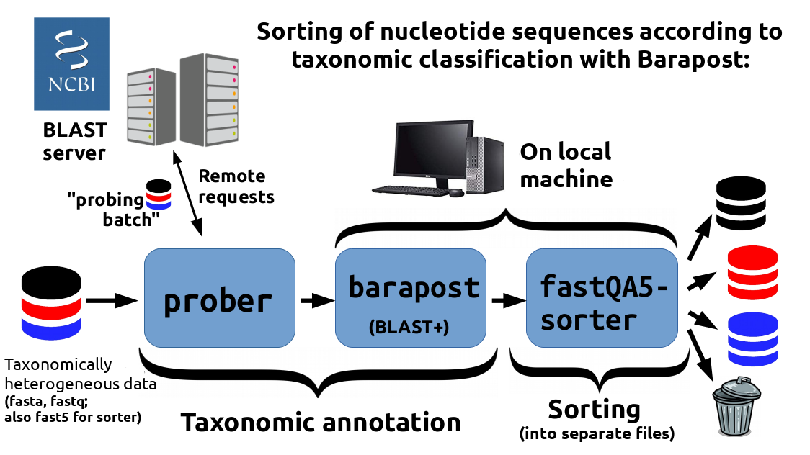

# Barapost toolkit

**"Barapost"** command line toolkit is designed for binning of FASTA, FASTQ and FAST5 files (i.e. separation into different files) according to taxonomic classification of nucleotide sequences stored in them. Classification is implemented as finding the most similar reference sequence in a nucleotide database: remotely using NCBI BLAST web serveice or on a local machine with BLAST+ toolkit.

## Motivation

Find yourself constantly having a large amount of FASTA, FASTQ or FAST5 files, where sequences that belong to different organisms are **mixed up** together, but you want them to be **separated**?

It is awful to sit in front of the computer for hours sending all these sequences to NCBI BLAST server and to rewrite large FAST(A/Q) files by hand, isn't it?

"Barapost" toolkit is the thing that can do it for you and **save your time**.

## How to cite

You can find paper describing the toolkit together with benchmark at [https://doi.org/10.1109/TCBB.2020.3009780](https://doi.org/10.1109/TCBB.2020.3009780). If you use Barapost in your research, it would be great if you could cite us.

## Getting started

You can get "Barapost" in the following ways:

Way 1: go to terminal and run `git clone https://github.com/masikol/barapost.git`

Way 2: download ZIP archive (green button "Code" at the top right of this [page](https://github.com/masikol/barapost). Then "Download ZIP".

After that, you can find executable Python scripts in directory `barapost-master/barapost`. Scripts can be run in place.

Or you can add this directory to your PATH variable so that you won't need to enter full script's path to run it -- just it's name, for example:

```
barapost-prober.py some_reads.fastq
```
instead of
```
/home/user/some/more/long/useless/path/barapost/barapost/barapost-prober.py some_reads.fastq
```

If you are not sure how to do this, following links can help you:

- [Editing PATH on Linux](https://opensource.com/article/17/6/set-path-linux)
- [Editing PATH on Windows](https://www.computerhope.com/issues/ch000549.htm)
- [Editing PATH on MacOS](https://coolestguidesontheplanet.com/add-shell-path-osx)

## The workflow and what Barapost does

1. **barapost-prober.py** -- this script sends several sequences (i.e. only a part of your data set) to NCBI BLAST server in order to determine what taxons are "present" in data set. "barapost-prober.py" saves accession of best hit(s) of each sequence from probing batch. Processing all sequences in this way takes too much time, what leads us to "barapost-local.py".

2. **barapost-local.py** -- this script firstly downloads best hits "discovered" by "barapost-prober.py" from Genbank, then uses these downloaded sequences to create a database on local machine and finally classifies the major part of data using created database. Creating a database and "BLASTing" is performed by "BLAST+" toolkit.

3. **barapost-binning.py** -- this script bins (divides into separate files) nucleotide sequences according to results of "barapost-prober.py" and "barapost-local.py"



## More information:
  
  You can find detailed information about Barapost at [Barapost Wiki](https://github.com/masikol/barapost/wiki).